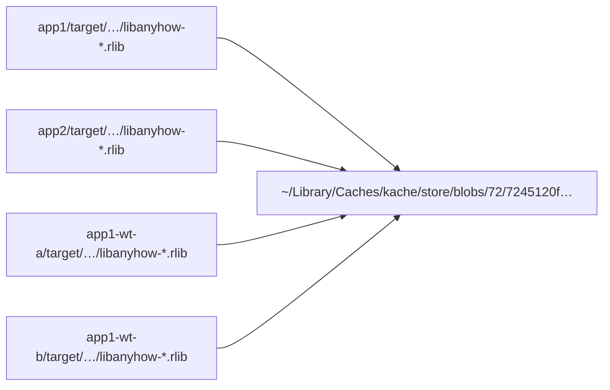

## はじめに

これからは local で Rust を開発する際は kache を使ってください。

Rust の build 成果物はサイズが大きく、1 プロジェクトでも数 GB になることがあります。
複数のプロジェクトを扱い、さらに AI 駆動開発で複数の worktree を維持しようとすると、ストレージを大量に消費してしまいます。

Rust 界隈ではこれまでビルドキャッシュとして sccache が使われてきました。
sccache は圧縮キャッシュを保管し、ビルドの際は `target/` にコピーします。
キャッシュによるビルドの高速化には寄与する一方、ストレージを大量消費する課題は解決することができません。

kache では reflink により `target/` が直接キャッシュを指すため、この問題をシンプルに解決しています。

この時点で kache に移行すべきと判断した方はぜひ移行方法に進んでもらい、実例を見てから移行したい場合は順番に読んでください。

## 実例

実例では以下のパターンで kache によって効率的なキャッシュが効いていることを確認します。

1. 異なるプロジェクトの間で同じ crate を使った場合、各 `target/` の中身がキャッシュへ reflink されること
2. 同じプロジェクトの複数の worktree が同じ crate を使った場合、各 `target/` の中身がキャッシュへ reflink されること

### 環境

- macOS Darwin 25.3.0 / APFS
- kache 0.12.0 (Homebrew)
- cargo 1.97.1
- `RUSTC_WRAPPER=kache` + `CARGO_INCREMENTAL=0`

### 検証セットアップ

app1 と app2 は別ディレクトリの独立した Cargo プロジェクトです。
どちらも同じバージョンの `serde` と `anyhow` に依存します。

worktree の検証には app1 を git 化して 2 つの worktree (`app1-wt-a`, `app1-wt-b`) を切りました。

```sh
cd app1
git init && git add . && git commit -m init
git worktree add ../app1-wt-a HEAD
git worktree add ../app1-wt-b HEAD
```

### ケース 1: 異なるプロジェクトの間で同じ crate を使う

異なるプロジェクトの間で同じ crate を使った場合、kache が効率よくビルドできることを確認します。

まず build time を比べます。app1 を先にビルドし、その後 app2 をビルドしました。

| 対象 | ビルド時間 | 備考 |
|---|---:|---|
| app1 (cold) | 2.92 s | store は空 |
| app2 (warm) | 1.03 s | app1 と同じ依存 → 全部 cache hit |

これは依存がキャッシュから reflink で復元されたため高速で終わったことを示します。

次に「同じ crate の `.rlib` が本当に共有されているか」を確認します。app1 / app2 / kache store の 3 か所にある `libanyhow-*.rlib` を比較しました。

| 場所 | SHA-256 | inode | link count |
|---|---|---:|---:|
| `app1/target/…/libanyhow-*.rlib` | `5cddf8de…` | 77809861 | 1 |
| `app2/target/…/libanyhow-*.rlib` | `5cddf8de…` | 77810279 | 1 |
| `store/blobs/72/7245120f…` | `5cddf8de…` | 77809869 | 1 |

同じ SHA-256 ですが inode は別で link count = 1 です。
つまり APFS によってデータ本体を複製せずに共有されています。

最後に「実ディスクが本当に共有されているか」を測ります。app2 の `target/` を丸ごと削除して、`df` の変化を見ました。

| 指標 | 値 |
|---|---:|
| 削除した `target/` の論理サイズ (`du`) | 26 MB (~26,624 KB) |
| 削除後に `df` で観測された解放量 | 4,088 KB |
| 差 = store と reflink 共有されていた分 | ~22 MB |

論理サイズは 26 MB ですが、削除して解放される物理サイズは 4.1 MB でした。
つまりほとんどは kache によるキャッシュであり、app2 の `target/` が独自に占有していたのは 4.1 MB だけです。
4.1 MB の中身は bin crate 本体、build script 出力などのアプリ固有の成果物であり、kache はキャッシュしません。

### ケース 2: 同じプロジェクトの複数の worktree が同じ crate を使う

同じプロジェクトの複数の worktree が同じ crate を使った場合、kache が効率よくビルドできることを確認します。

各 worktree でそれぞれ `cargo build` を回しました。

| 対象 | ビルド時間 | 備考 |
|---|---:|---|
| `app1-wt-a` | 0.93 s | store には既に blob あり |
| `app1-wt-b` | 0.87 s | 同上 |

このとき、store には新しい blob は 1 つも追加されませんでした (追加量 0 MB)。

ケース 1 と同じく `target/` の削除で実ディスクの解放量を測りました。

| 指標 | 値 |
|---|---:|
| 2 つの `target/deps` の論理サイズ合計 | ~52 MB |
| 両方削除後に `df` で観測された解放量 | 8,124 KB |
| 差 = store と reflink 共有されていた分 | ~44 MB |

worktree を増やしても `target/` の実体は膨らまないことが分かります。

### 参照関係のイメージ

具体的にどのようにキャッシュが管理されているかを以下に示します。
物理的には `~/Library/Caches/kache/store/blobs/72/7245120f…` にキャッシュがあり、各 `target/` は reflink でキャッシュを共有する構造になっています。



### `kache report` の出力

app1 / app2 の連続ビルド直後に `kache report` を実行した結果の抜粋です。

```
50.0% hit rate — 8/16 cacheable crates cached, 8 compiled
Storage:
  Restored: 25.4 MB (100.0% zero-copy, 0 B copied)
  Store: 25.4 MB logical -> 25.4 MB blobs (0 B dedup saved)
```

つまり 100% キャッシュから復元され、1 バイトもコピーせずに済んだことを示します。

より詳細な生ログや検証手順は [REPORT.md](https://github.com/poi2/kache-poc/blob/main/REPORT.md) にまとめてあります。

## 移行方法

Mac への kache のインストールは Homebrew から 1 コマンドで完了します。
他の OS や他のインストール方法は [公式のインストールガイド](https://github.com/kunobi-ninja/kache#install) を参照してください。

```sh
brew install kunobi-ninja/kunobi/kache
```

続いて `kache init` で初期設定を行います。

```sh
kache init
```

このコマンドは `~/.cargo/config.toml` に `rustc-wrapper = "kache"` を追記し、背景 daemon を起動します。
設定が正しく反映されているかは `kache doctor` で確認できます。

既に sccache を使っている場合は、次の 1 コマンドで kache に置き換わります。

```sh
kache doctor --fix --purge-sccache
```

rustc-wrapper が kache に切り替わります。

:::message alert
`--purge-sccache` オプションを付けると sccache のキャッシュディレクトリとバイナリが削除されます。sccache に戻す予定がある場合は付けないでください。
:::

### 前提条件と注意点

移行前に確認しておきたい点が 3 つあります。

- プラットフォームが macOS、Linux であること
  - 現時点においては Windows ではエコシステムは薄めです。
- ファイルシステムが APFS / btrfs / XFS-with-reflink であること
  - reflink による zero-copy は APFS / btrfs / XFS-with-reflink でのみ有効であり、macOS (APFS) と最近の Linux (btrfs) で最も効果を発揮します。
- 差分ビルドが無効化されること
  - kache は APFS 関連の破損問題を避けるために `CARGO_INCREMENTAL=0` を強制します。開発中に何度もビルドを回すような単一プロジェクトでは、sccache + 差分ビルドの方が総ビルド時間は短くなる可能性があります。

:::message
大規模プロジェクトでの検証は行っていないため、参考程度に扱ってください。
:::

## 結論

結論として local Rust 開発においては kache を使ってください。
現環境において kache を使う方が明確に開発体験が良いです。

CI においても kache は有効ですが、local ほど大きなメリットはありません。
なぜなら CI 環境は毎回破棄されるため `target/` の肥大化が問題になりませんし、キャッシュヒットさえすれば即物的な差は小さいからです。
とはいえ、toolchain を統一する方が自然な設計なので、今後を見据えると kache で統一することが望ましいでしょう。

いずれにせよ local では kache を使い、新規プロジェクトでは local でも CI でも kache を使うのが良いでしょう。

## 参考文献

@[card](https://github.com/kunobi-ninja/kache)

@[card](https://kunobi.ninja/docs/kache)

@[card](https://kunobi.ninja/blog/open-sourcing-kache)

@[card](https://github.com/mozilla/sccache)
